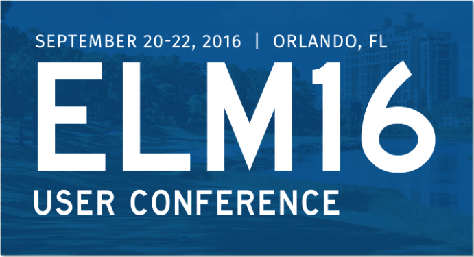

```
Roberto Nogueira  
BSd EE, MSd CE
Solution Integrator Experienced - Certified by Ericsson
```
# Tutorial Elm-conf 2016



**About**

Learn everything you need to about the subject of this `Tutorial` project.

[Homepage](https://www.youtube.com/playlist?list=PLglJM3BYAMPH2zuz1nbKHQyeawE4SN0Cd)

## Topics
```
[ ] "Code is the Easy Part" by Evan Czaplicki 38:26 
[ ] "Beyond Hello World and Todo Lists" by Ossi Hanhinen 33:35 
[ ] "Compilers as Therapists, or Why Elm is Good for ADHD" by Luke Westby 13:50 
[ ] "Rich Animation" by Matthew Griffith 9:16  
[ ] "Functional Data Structures" by Tessa Kelly 10:09 
[ ] "0-60 in 15 Minutes: Building a Realtime App With Elm and Horizon" by Abadi Kurniawaan 8:45  
[ ] "Rolling Random Romans" by Joël Quenneville 19:23  
[ ] "Building an Interactive Storytelling Framework in Elm" by Jeff Schomay 19:56  
[ ] "The Clockwork Gardener: Growing an Elm App With Templates" by Jessica Kerr 23:56  
[ ] "Nightingale.space - Elm and Crowd-Sourced Music Making" by Murphy Randle 32:01  
[ ] "Making Impossible States Impossible" by Richard Feldman 25:06 
[ ] Q&A Panel
```
